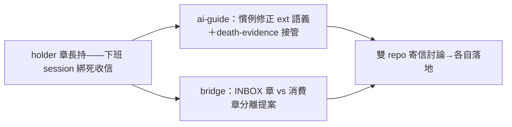

## Description

<!-- SECTION:DESCRIPTION:BEGIN -->
bridge repo sess_1f2a2cda 遇到：holder 章長持導致下個 session 無法 consume（荒繆狀況——排班值星退場後新形態下 holder 歸屬更模糊）。user 提出兩方向：①dutymail 面（bridge repo 份額）：章分級——INBOX 章（ext 長持、只服務 viewport 顯示）vs 消費章（AI session 短持、prepare/ack 用）分開；或恢復某種 idle-lease（AIR-288 拔掉的時鐘只對「AI 消費者持有」的章有意義）②AIR-225 慣例面（ai-guide repo 份額）：修正慣例文字——ext 長持只及 escalation／人類 viewport 地址；marshal 地址章歸「當時的值星 session」，session 死後進 death-evidence 接管（不用等 24h——AI session 的心跳可判）。兩 repo 各有份額，相互寄信討論。

<!-- SECTION:DESCRIPTION:END -->

## Implementation Plan

<!-- SECTION:PLAN:BEGIN -->
①ai-guide 慣例修正（本卡主體）②寄信 bridge＋SC 提案章分級③互相討論後各自落地
<!-- SECTION:PLAN:END -->

## Acceptance Criteria
<!-- AC:BEGIN -->
- [ ] #1 ai-guide 慣例修正落地（ext 長持語義＋death-evidence 接管）
- [ ] #2 bridge 側章分級提案回執（相互討論閉環）
<!-- AC:END -->

## Implementation Notes

<!-- SECTION:NOTES:BEGIN -->
- 10-09 作者完成 0c98870f（前 spawn bb05e377 中斷死亡重派 agent_923346cc——exec log 凍結 20:50 實證）：三檔 +23/-10，全套 3791 passed
- bridge db100 對齊信收訖（三開放點：①預設 Consume ②INBOX prepare 不推 cursor＋role gate ③death-evidence=session_discovery seam＋24h 常數）——bridge 將開卡 role gate＋S1 amendment，兩卡互引
- 本卡慣例文 delta（判死＝內容面心跳非時鐘等待；code 面 HOLDER_STALE_SECONDS 收緊歸 bridge/duty 弧）待本卡 merge 後回信 bridge 交代，讓其 S1 amendment 反映終態慣例
- 審查鏈跑中（codex＋5.3 雙腿）
<!-- SECTION:NOTES:END -->

## Final Summary

<!-- SECTION:FINAL_SUMMARY:BEGIN -->
<!-- SECTION:FINAL_SUMMARY:END -->

## Definition of Done
<!-- DOD:BEGIN -->
- [ ] #1 老規矩審查鏈
<!-- DOD:END -->
