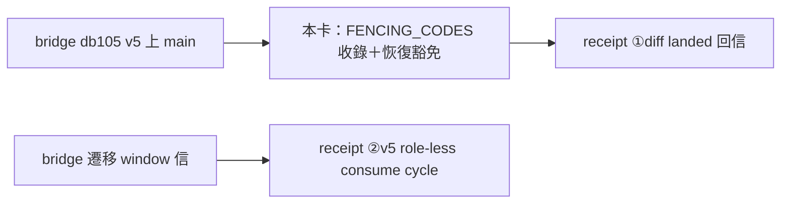
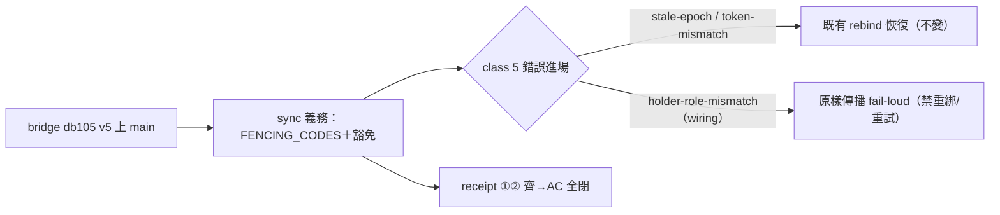

## Description

<!-- SECTION:DESCRIPTION:BEGIN -->
bridge db105-shipped-sync-001-1791648900（DB-105 holder role tiering 三段全上 bridge main a9b653b，integrated gate 綠）開出的我方消費端 sync 義務（EP R1 rollout）：FENCING_CODES 增 `holder-role-mismatch`（class 5）——語義＝**章別接線錯誤（wiring error）**，不是 fencing recovery 觸發條件，**禁重綁/重試**。陷阱：既有 `_is_fencing` 按 error_class 路由（class 5 全進 rebind 恢復），新碼若僅收錄詞彙集會被誤觸發重綁——須 code 級豁免。其餘不變：stale-epoch／holder-token-mismatch 各自章內語義照舊；duty_receive 維持 role-less Consume（v5 legacy pin M2R-LEGACY-01，零呼叫形態變更）；處理鏈不用 receive peek（零寫入不推 cursor）。部署節奏：v5 store 遷移由 bridge 另行 letter 約 window（遷移前 v4 行為不變；遷移後 v4 binary 無法重開 v5 store——rollback 錨點＝遷移前備份）。

<!-- SECTION:DESCRIPTION:END -->

## Acceptance Criteria
<!-- AC:BEGIN -->
- [x] #1 `holder-role-mismatch` 收錄 FENCING_CODES＋恢復路徑豁免（`_is_fencing` 不路由——禁重綁/重試，wiring error fail-loud 交 per-address fail-soft）；RED→GREEN 測試釘死「不觸發 rebind」＋既有詞彙釘測同步
- [x] #2 bridge acceptance receipt 兩項：①diff landed 回信（本卡 merge 後寄）②對 v5 binary 錄一次 role-less consume cycle（**blocked：待 bridge 遷移 window 信**）
<!-- AC:END -->

## Implementation Plan

<!-- SECTION:PLAN:BEGIN -->
①RED：測試釘 `holder-role-mismatch` 不觸發 `_bind_fresh`（exception 原樣傳播）＋詞彙集釘測更新②GREEN：`FENCING_CODES` 收錄＋`WIRING_ERROR_CODES` 豁免集＋`_is_fencing` 加 code 過濾＋docstring 對齊③全套＋ruff④老規矩鏈（bi codex+glm→5.3 judge→commit→merge）⑤receipt ①回信。
<!-- SECTION:PLAN:END -->

## Definition of Done
<!-- DOD:BEGIN -->
- [ ] #1 老規矩審查鏈（codex＋glm 雙腿→5.3 judge）
<!-- DOD:END -->

## Implementation Notes

<!-- SECTION:NOTES:BEGIN -->
【來源】db105-shipped-sync-001-1791648900（class sync；bridge main a9b653b＝P1 58b71a0/P2 123e874/P3 6449f6a；EP＝00-tasks/2026-10/10-09-holder-tiering/ep.md R1 rollout dispatcher-owned 項）。
【審查鏈收口】codex needs-attention（F1 legacy ack 落 transient 桶＋多發一次 prepare）＋GLM approve（F1' 釘測 vacuous assertion——tuple vs list 恆真）→judge（GLM-5.3 job-mv1sjfg0）：F1 advisory（現行已滿足 AC——零 rebind、同 cycle 大聲終結；~3 行對齊修建議併入）、F2 fix-now（AC 證據名實不符，commit 前必修）。收口 52a44613：F2 斷言 list 化＋釘精確呼叫形狀＋F1 併入（`_resolve_legacy_batch` wiring error 原樣傳播＋legacy ack 迴歸測試補零覆蓋情境）。全套 3803 passed；merge 52a44613、probe 綠。AC#1 完鎖；AC#2②待 bridge 遷移 window。
【AC#2 全閉（10-10 晚）】receipt ① ACK（air299-receipt1-ack-001——bridge 認帳 AC#1 閉環）；receipt ② 由 bridge 親錄（air299-receipt2-v5-cycle-001）：binary 3.10.0、store v4→v5 一次性遷移（user_version=5＋foreign_key_check 0 violation＋holders 保真 role='consume'＋備份 store.sqlite3.pre-v5-migration-backup）、role-less consume cycle RC=0（既有 session token 無縫續用＝M2R-MIGRATE-01 生產實證；holder status 增 role:"consume" additive 欄、receive status 回 inboxBindingEpoch:0）——明示「兩項 receipt 齊備，你方 AC 可全閉」。我方側複驗：本 store user_version=5、epoch 103 role='consume' 續用中（無縫、無需重綁）。附帶：epoch-22 孤兒綁定（SC reload 未 release）operator takeover 22→23→release→24 解封——AIR-298 operator 面第二次實證。bridge 後續：3.9.1 pin hotfix 已 landed、3.10.0 supply v2 實作中（落地後 caller 定義供給教學按 rollout 節同步）。
<!-- SECTION:NOTES:END -->

## Final Summary

<!-- SECTION:FINAL_SUMMARY:BEGIN -->
DB-105 v5 消費端 sync 全閉：`holder-role-mismatch` 收錄 class 5 詞彙＋`WIRING_ERROR_CODES` 恢復豁免（prepare 面禁重綁/重試＋legacy ack 面原樣傳播——wiring error 不落 transient 保留桶），RED→GREEN 釘測＋legacy ack 迴歸補零覆蓋情境，全套 3803 passed。bridge 兩項 receipt 齊（①diff landed 認帳、②v5 binary role-less consume cycle RC=0——store 已遷 v5、既有 token 無縫續用），我方 store user_version=5 複驗通過，AC 全閉 Done。

<!-- SECTION:FINAL_SUMMARY:END -->
