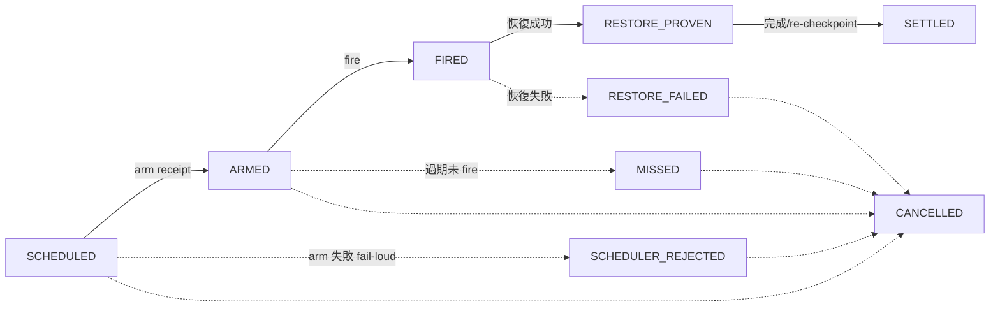

# /at — 排程工作接續

在指定時間自動 resume 當前工作。對應 Unix `at` 命令（one-shot 排程）。

適用 LLM provider usage reset 後自動接續。排程觸發時 host 必須開啟（Claude Code = terminal session；ZCode = app）。

每次 /at 產生一張 **ticket**（`.agent-tmp/at-tickets/<ticketId>.json`，一律經 `/Users/ctai/Github/ai-guide/scripts/at_ticket.py` 讀寫）——ticket 帶生命週期狀態機（見「Ticket 生命週期狀態機」節）：排程 arm 失敗 fail-loud 禁靜默降級、fire 後「做完沒」機械判準、cleanup 依 `resume_at＋state＋grace`（mtime 已淘汰）。

> **與 `/handoff` 分工**：本命令是「時間接續」（usage 用盡，**自己 resume**）；要把工作交給**另一個** session/provider 並行或接手，用 [`/handoff`](../handoff/SKILL.md)。

> **與 `/usage-ping` 分工**：本命令時間後面要接**任務**（reset 後自動接續工作）；只寫時間、只叫醒 LLM 確認配額回來（最小 call 成本、不接任務），用 [`/usage-ping`](../usage-ping/SKILL.md)。

---

## 執行流程

### Phase 0：先結算再排程（checkpoint-first）

排程前依 [task-recovery](../_common/task-recovery.md)「寫入端」把工程狀態落進 durable 載體；ticket 只承載**任務身份與指針**——不抄 read-set、規格、完成度：

1. 有卡且具 board 寫權 → 卡 notes 為 durable owner（checkpoint 必要欄位＝task-recovery 寫入端表）；該弧原有 EP → 併 append EP 進度節（詳細 plan/evidence owner）——**board single-writer：無 board 寫權的 session 連指針行也不寫**，改在 ticket `owner_ref` 註記 `card: <id>（未寫 notes，無權）`
2. 無卡 → 該弧原有 EP → 只 append EP 進度節；都無 → 既有 `.agent-tmp/session-journal.md`；user 指定 report → 該 report
3. STATE.md 僅在本 session 確有轉向／卡點觀察時更新（觀察層職責不變）；禁把 read-set／完成度／EP checkpoint 抄進 STATE 或 ticket
4. UC 級任務排程前必須已有卡——**/at 不建卡**（排程不是建卡入口；臨時非 UC 工作走 `task_ref: ad-hoc`，見 Phase 2）

> **接續授權失效條款**：resume 卷開場＝新授權週期——**卷內既有授權全部失效，outward 動作一律 PENDING**（outward-action-consent「一次授權≠永久授權」的會話層投影）；本命令的自主執行指令**不得解讀為授權展期**——自主續工可以，outward 動作照 PENDING 規則回報待 user 拍板。例外＝conditional commit delegation 不從舊卷繼承、但可從 canonical arc state＋當次 gate evidence 重新建立（predicate＝commit skill），重新成立即依 outward rule 執行。條款句＝Phase 3 capsule invariant。

### Phase 1：解析時間 + 提取任務目標

1. **解析用戶輸入**：

   | 輸入格式 | 解析方式 | 範例 |
   |---------|---------|------|
   | `HH:MM` | 今天指定時間；已過 → 明天 | `14:30` → 今天 14:30 |

   **觸發時刻 T = 輸入 +1 分鐘**（秒數誤差防護；時間邏輯同 [usage-ping](../usage-ping/SKILL.md)）。計算 cron 表達式（5-field：`分 時 日 月 週`）用 T pinned 到具體日/月（當前日期以 `date` 輸出為準，跨日跨月交給 `date -v` 疊加**不手算**），DoW = `*`。**不做整點/半點提前 shift**。

> **不支援相對時間**（`+Xh`/`+Xm`）：相對延遲須換算成絕對時刻，註冊瞬間時刻已過會靜默滾到一年後才觸發。用戶給相對時間時，用 `date` 查當前時間換算成絕對時刻（跨日時明確向用戶確認目標日期），再排程。

2. **提取任務目標**：時間之後的所有文字為**任務目標一行**（進 ticket 的 goal）；詳細規格／read-set 住 durable owner（卡 notes／EP 進度節／journal），不展開進 ticket。

### Phase 2：寫入 ticket（狀態機起點 SCHEDULED）

呼叫 ticket helper 建票——固定 schema、atomic 寫、禁自由散文（缺欄位 helper 直接拒寫）；ticket 只承載任務身份與指針：

```bash
uv run python /Users/ctai/Github/ai-guide/scripts/at_ticket.py new \
  --dir .agent-tmp/at-tickets \
  --goal "{任務目標一行}" \
  --resume-at "{ISO 時間（Phase 1 的 T，含時區）}" \
  --task-ref "{卡 id | ad-hoc}" \
  --owner-ref "{EP 路徑#進度節 | .agent-tmp/session-journal.md | none}" \
  --project-path "{當前專案路徑}"
```

- stdout 回 receipt（ticketId／path／state）；同 id 已存在＝fail-loud（換 id，禁覆蓋）
- `task_ref`／`owner_ref`＝read-set 指針——「已有欄位不重抄」（[task-recovery](../_common/task-recovery.md)）
- ad-hoc 任務（無卡非 UC）：`--task-ref ad-hoc`＋一行 goal 即可；若任務已需要大量規格，代表不再 ad-hoc——先進 durable owner 再排程
- **版控排除（一次性設定）**：ticket 含任務目標描述——確認 `.agent-tmp/` 已入該專案 `.gitignore` 或全域 `core.excludesFile`

### Phase 3：arm 排程（CronCreate）＋狀態機落地

呼叫 `CronCreate`（cron 欄位依 Phase 1 計算，`recurring: false` one-shot）。prompt capsule **八行封頂**：

```
🔴 /at resume — {resume_time}，task_ref: {task_ref}
context: {ticket_path}

1. 讀 ticket → 沿指針讀 durable owner（卡／EP 進度節／journal）→ 按 {repo 絕對路徑}/skills/_common/task-recovery.md 恢復順序核對當前實物（git log/status），接續剩餘工作
2. ⛔ 前卷 outward 授權已失效——commit/push/deploy/send 等 outward 一律 PENDING 等新授權；其餘工作自主完成
3. ticket 缺失／不可讀 → 以 task_ref 定位 durable owner；仍無法確立任務身份 → 產出狀態報告（首行標 `at-ticket missing: {path}`），禁靜默結束、禁推測另一任務
4. ticket 推進 SETTLED 的時機＝恢復已成功且（工作完成 OR 進度已 re-checkpoint 回 durable owner）
```

> **capsule invariants**：第 2、3 條是 /at 特有語義（授權失效＋fail-loud）——**禁併入 generic recovery 指針、禁後續簡化移除**（review 時當 gate 查）。`task_ref` 在 capsule 與 ticket 各留一次＝刻意的**身份冗餘**（ticket 被清淤誤刪後 fresh session 仍能辨認任務），非 read-set 投影。

**arm 結果必落票（禁靜默）**——helper exit code 是唯一判準：

- **成功** → `transition --ticket <path> --to ARMED --arm-receipt-json '{"jobId": "<job_id>"}'`——**arm receipt 必留**（無憑 ARMED＝helper raise；CronList 對照也靠它）
- **失敗**（被拒／工具缺席／任何錯誤）→ `reject --ticket <path> --reason "<診斷>"`——ticket 落 SCHEDULER_REJECTED、exit 1、stderr 印診斷

> **禁靜默降級（gate）**：arm 失敗後**禁**退背景 sleep／`sleep`+喚醒等 session 內替代——sleep 綁 session 存活，session 死＝保險全滅（三連敗實證）；CronCreate 被拒與 session 內 sleep 是兩個 failure domain，**不可互為 fallback**。處置只有兩條：向 user 回報 arm 失敗原因，或 `transition --to CANCELLED` 結案（Phase 0 已 checkpoint 的狀態照舊在 durable owner，不受影響）。替代 scheduler adapter 須為獨立 failure domain 且經驗證——沒有就標 unsupported，**不自造 scheduler primitive**。SCHEDULER_REJECTED 票非 terminal 禁清（sweep 會持續回報 past-due 直到明示處置）。

> **已知缺口（真實案例：southchariot sc-231.1）——CronCreate 行為依 session host 分兩道牆**：
>
> - **牆一（extension-chat-hosted session）——arm 即死**：`CronCreate` 恆失敗「Cannot verify whether this session belongs to a scheduled task」。**根因（逆向實證）**：CronCreate 前置需 App 代答 carrier→App 反向請求 `automation/checkTaskBinding`／`automation/list`（handler 住 desktop host）；SC extension（chtai.southchariot）只實作四個 server-request handler（runtimePrefs／MCP auth／permission／userInput），automation/* 恆回 -32601——**永久 capability gap 非暫態**，「Try again later」文案誤導，重試無效。
> - **牆二（CLI-hosted session）——arm 成功、fire 失敗**：CronCreate 回 automationId、automations 表有 row，但 desktop dispatch 失敗「Automation 模型选择不可用，请重新选择模型与思考档位」（`dispatch_status=failed_to_dispatch`）——ticket 落 ARMED 後永不 FIRED，sweep 報 missed-candidate。**arm 成功≠會 fire**，排程是否可用以 desktop Automations UI 的 dispatch 狀態為準。**根因（automations 表 7 vs 1 對照實證）**：CronCreate 把呼叫端 provider 視角 `builtin:zai-coding-plan` 原樣序列化進 `model_selection.providerId`，desktop dispatcher 只解析 registry canonical `account:zai-individual-coding-plan`——desktop UI／舊 session 建的 7 筆（`account:`）全 dispatched、程式化建的 1 筆（`builtin:`）failed；同 model 同 mode 同 cron 慣例，唯一差異 providerId 前綴。**繞道**：desktop Automations UI 對該排程重選模型。
> - **共通繞道**：排程走 ZCode desktop app 內建 Automations UI（desktop host 實作全部 automation handler，desktop scheduler 為唯一 authority）；arm 失敗照上 gate 落 SCHEDULER_REJECTED（禁重試轟炸）；arm 成功但屬牆二的排程，用 UI 重選模型救回。
> - **出路（條件式，非承諾）**：牆一＝carrier 端 Patch（app-server 直呼官方 AutomationService）已 probe 可行（~3 檔百行級）；牆二＝upstream proposal（CronCreate 序列化點把呼叫端 provider 視角解析成 registry canonical `account:` 形式——映射知識＝carrier 自家 provider registry 既有內容，非新發明）。兩者均待 user 拍板沿上游通道轉呈，落地前本 gap 不變。

### Phase 4：確認 + 通知

印出排程摘要（ARMED 後）：

```
✅ 排程已建立（/at）
- Resume 時間：{HH:MM}（輸入 +1 分後的實際觸發時刻）
- Cron ID：{job_id}
- Ticket：{ticket_path}（SCHEDULED → ARMED，arm receipt 已留）
- task_ref：{task_ref}｜任務：{任務目標一行}
```

**通知 adapter 化**：上塊文字摘要為主通道（必印）；語音 `say -v Meijia -r 180 "已排程在 HH:MM 接續工作"`（報實際觸發時刻）為**可選**增強——headless／無音訊環境必敗，失敗不重試、不擋流程、不計失敗（與 arm fail-loud 不同面：通知是增強不是保險）。

---

## Ticket 生命週期狀態機



五主態＋四異常；轉移表外一律 `IllegalTransition` fail-loud（**禁復活禁跳級**——重新排程＝開新 ticket，非改舊票）：

| 轉移 | 誰推進 | 證據 |
|---|---|---|
| SCHEDULED→ARMED | 排程當下 session | arm receipt（CronCreate jobId） |
| SCHEDULED→SCHEDULER_REJECTED | 排程當下 session | reject reason（exit 1＋stderr 診斷） |
| ARMED→FIRED | resume 觸發的 session | 觸發事實（capsule 卷開場＋CronList 對照） |
| ARMED→MISSED | sweep／任一 session | unsupported window 證據 note（必帶） |
| FIRED→RESTORE_PROVEN | resume session | 恢復成功（實物核對通過） |
| FIRED→RESTORE_FAILED | resume session | 恢復失敗診斷 reason（必帶——helper 強制；fail-loud 禁吞） |
| RESTORE_PROVEN→SETTLED | resume session | 工作完成或進度 re-checkpoint 回 durable owner |
| SCHEDULED／ARMED／SCHEDULER_REJECTED／MISSED／RESTORE_FAILED→CANCELLED | 處置 session | 明示取消／結案（FIRED／RESTORE_PROVEN 無此出口——先推回主線） |

**fire 後「做完沒」＝機械判準**：ticket 狀態（FIRED 之後有無推進到 RESTORE_PROVEN／SETTLED）＋`CronList` 現場組合查，**非讀 ticket 或 prose 敘述**。

### MISSED 誠實標記

- **unsupported window**：one-shot 觸發時刻 host 關閉（overnight blind window）＝排程定義仍在但無 dispatch——現行 harness 無可靠 covering trigger（SessionStart 不能當 covering；偵測面 zcode scheduled task POC 為後續卡，本 skill 不自造偵測）
- sweep（`classify`）對 ARMED 超過 `resume_at`＋tolerance 未見 fire 證據的 ticket 回報 `missed-candidate`；處置＝`transition --to MISSED --note "unsupported window: <證據>"`（note 必帶——helper 強制）
- **badge**：任何接手 session 的報告首行標 `🟡 at-ticket MISSED: {ticketId}（unsupported window）`——禁靜默略過、禁假裝準時
- MISSED 非 terminal——唯一出口 CANCELLED（重排＝另開新 ticket）；禁把 MISSED 票當有效排程直接續跑

---

## Resume 後的行為

/at 場景落點＝讀 ticket（狀態應為 ARMED）→ `transition --to FIRED` → 按 [task-recovery](../_common/task-recovery.md) 恢復順序執行（定位任務→核對實物→恢復→接續）→ 恢復成功即 `transition --to RESTORE_PROVEN` → 工作完成或進度 re-checkpoint 回 durable owner 後 `transition --to SETTLED`。恢復失敗＝`transition --to RESTORE_FAILED`＋診斷（fail-loud，禁吞錯續行）。完成通知沿用 [voice-notification](../voice-notification/SKILL.md)「任務完成」樣板（隨機稱謂）＋清 sentinel。

capsule 第 4 條的刪檔時機＝對應 ticket 到達 SETTLED（或 CANCELLED）——刪除與狀態推進同輪完成，禁刪未達 terminal 的 ticket。

---

## 清理（sweep 機械分類；禁 mtime 口徑）

```bash
uv run python /Users/ctai/Github/ai-guide/scripts/at_ticket.py classify --dir .agent-tmp/at-tickets
```

- **SETTLED 或 CANCELLED 才可清**，且須 `now ≥ resume_at＋grace`（`CLEANUP_GRACE_S` 預設 7 天——dogfood 複核點）：兩條件同時滿足的票由 session 顯式刪檔
- 判準＝**resume_at＋state＋grace**，mtime 不參與——舊制以檔案 mtime 年齡掃描（7 天線）會**誤刪長程排程的未到期 ticket**（已知缺口已閉合：改機械判準）
- 非 terminal 永不清：`missed-candidate`／`past-due` 由 classify 上 stderr 大聲回報，處置權在 session（MISSED 標記／CANCELLED 結案）——**sweep 只分類不刪**
- 損壞票＝TicketCorrupt fail-loud（禁靜默跳過）——數據完整性優先，先處置損壞票再談清淤

---

## 使用範例

```bash
# 指定時間接續（14:30 輸入 → 14:31 實際觸發）
/at 14:30

# 指定時間 + 任務目標一行（規格在 EP/卡，ticket 只留指針）
/at 14:30 繼續 EP 段落 3
```

---

## 執行約束

- **觸發時 host 必須開啟**：排程由 host 進程在觸發時刻 dispatch — Claude Code 是 terminal session、ZCode 是 app；關閉期間到點不觸發，重開後排程定義仍在但補觸發無保證——此即 unsupported window，ticket 走 MISSED 誠實標記，不假裝準時
- **生命週期因 harness 而異**：Claude 綁 session（session 結束排程即消失）；ZCode automation 持久於 workspace（跨重啟存活、one-shot 跑完留 completed 記錄不自動刪）——殘留檢查用 CronList、清理用 CronDelete
- **one-shot miss 識別**：ZCode 上 one-shot 若觸發時刻 host 未開啟，記錄可能呈 `enabled=false`＋`lifecycleStatus=completed`＋`runCount=0` 且無 `lastRunAt`——外觀 completed 但並未執行；判讀**不可依賴 `runCount`/`lastRunAt`**，以 `CronList` 現場狀態＋ticket 狀態組合為準（機械判準，見「Ticket 生命週期狀態機」節）
- **清理**：依「清理」節機械判準執行——SETTLED 或 CANCELLED 才可清、grace 未滿不清、非 terminal 永不清
- **多個排程**：若 `.agent-tmp/at-tickets/` 已有非 terminal ticket，提示用戶確認是否有衝突
- **排程經濟**：每次觸發即消耗 quota（≈1 prompt + 全 context 重送）——排**資訊密集**的任務，polling 型（usage-ping 類）保持最低頻率
- **通知 adapter**：文字摘要必印；`say` 語音可選（headless 必敗——失敗不重試不擋流程）；語義規範遵循 [voice-notification](../voice-notification/SKILL.md)
